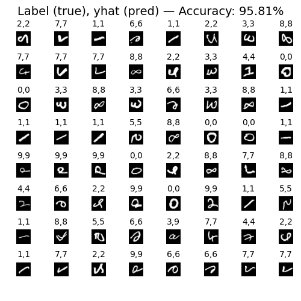
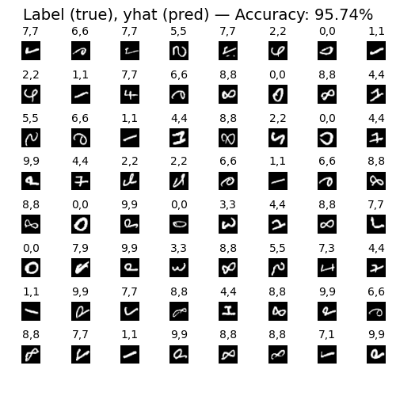

# 🧠 Distributed Training with TensorFlow: Single Worker vs MultiWorker Strategy

This is my graduation project demo that compares the **training performance** of a deep learning model using **TensorFlow’s MultiWorkerMirroredStrategy** across containers on a single physical machine.

---

## 📌 Project Description

The project evaluates how training speed and accuracy differ when:
- **Using a single container** (single worker).
- **Using three containers** (three workers) in a distributed setup with TensorFlow's `MultiWorkerMirroredStrategy`.

All experiments are executed on the same local physical machine using Docker containers.

---

## 🗂️ Dataset & Preprocessing

- **Dataset**: MNIST (60,000 grayscale images of handwritten digits, 28x28 pixels)
- **Preprocessing**:
  - Each image is flattened into a 1D array of 784 features.
- **Model Architecture**:


  - Input: 784 features
  - Layer 1: Dense(25, ReLU) — 19,625 parameters
  - Layer 2: Dense(15, ReLU) — 390 parameters
  - Layer 3: Dense(10, Linear) — 160 parameters

- **Data Split**:
  - **64%** (38,400 samples) for training
    - In MultiWorker setup: split equally — 12,800 per worker
  - **16%** (9,600 samples) for validation
  - **20%** (12,000 samples) for testing

---

## ⚖️ Results

| Setup               | Accuracy (%) | Training Time (s) |
|---------------------|--------------|-------------------|
| Single Worker (1 container) | 95.81 | 171.07 |
| MultiWorker (3 containers) | 95.74 | 740.07 |

On a smaller subset (5,000 samples):

| Setup               | Accuracy (%) | Training Time (s) |
|---------------------|--------------|-------------------|
| Single Worker | 91.90 | 15.46 |
| MultiWorker | 90.07 | 87.75 |

- Test set results for single worker:



- Test set results for 3 workers:


---

## 🧠 Why MultiWorker Was Slower

Despite the potential benefits of distributed training, the MultiWorker setup was significantly slower due to:

### 1. **Communication Overhead**
- TensorFlow uses `AllReduce` to sync gradients across workers.
- Virtual networking between containers is less efficient than real hardware networking.
- Communication often becomes the bottleneck.

### 2. **Insufficient Data**
- With small datasets like MNIST, each worker handles a small batch, reducing parallelization benefits while increasing communication cost.

### 3. **Shared Hardware Resources**
- Running multiple containers on the same machine means shared CPU usage → resource contention.

### 4. **Suboptimal `tf.data` Pipelines**
- Improper use of `shuffle()`, `prefetch()`, and `cache()` can cause input bottlenecks.
- For example, small `buffer_size` in `shuffle()` can severely hinder performance.

---

## ✨ Highlight

When increasing the dataset from 5,000 to 60,000 samples:
- The time ratio between 3 containers vs. 1 container decreased from **5.68x** to **4.33x**,
- While maintaining similar accuracy (above 90%).

This shows **distributed training scales better with larger datasets**.

---

## 🚀 How to Run the Project

### 1. MultiWorker Training

```bash
git clone https://github.com/phamchivy/Parallel-Computing.git
```

```bash
cd Parallel-Computing/HWR-multi-worker/train
docker build -t <your-image-name> .
cd ..
docker-compose up -d
docker ps                 # To see running containers
docker logs <container-id>  # Monitor training logs
```

### 2. Single Worker Training

```bash
cd Parallel-Computing/HWR-single-worker/
docker build -t <your-image-name> .
docker run -v ../output:/app/output <your-image-name>
```

## 🛠️ Technologies Used

- Python + TensorFlow
- Docker & Docker Compose
- MNIST Dataset
- Bash CLI

## 📬 Contact

- Created by Pham Chi Vy.
- Hanoi University of Science and Technology (HUST).
- For questions or feedback, feel free to reach out via GitHub Issues!

